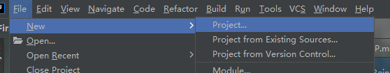
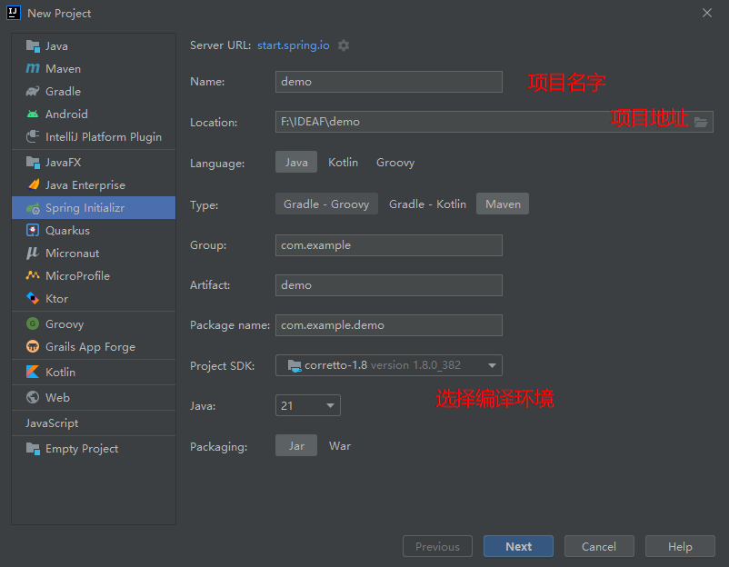
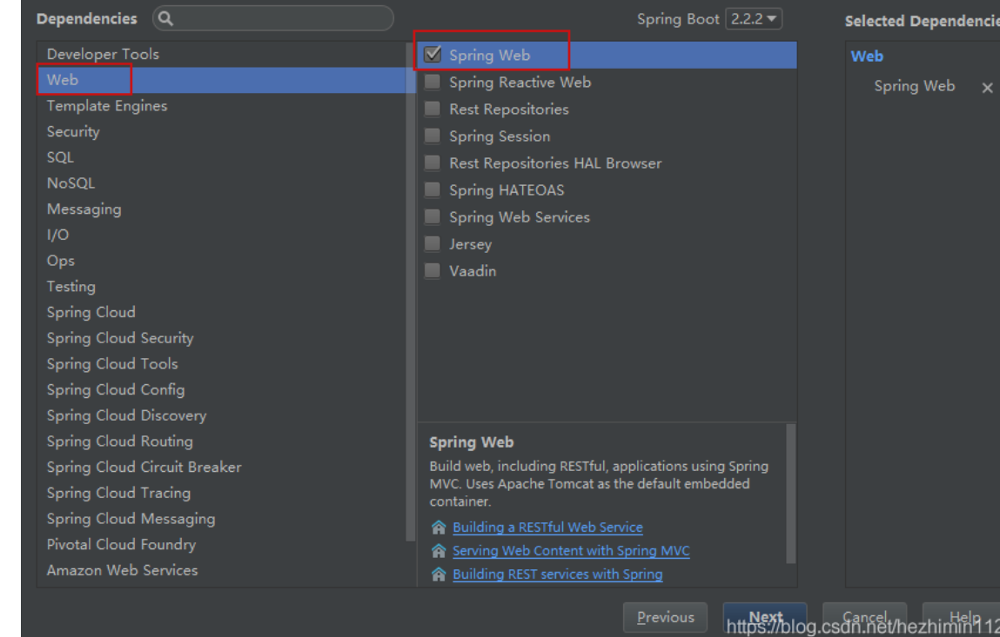
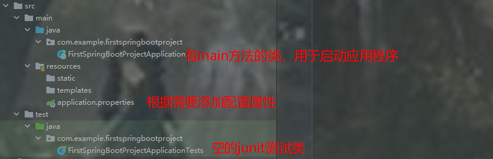
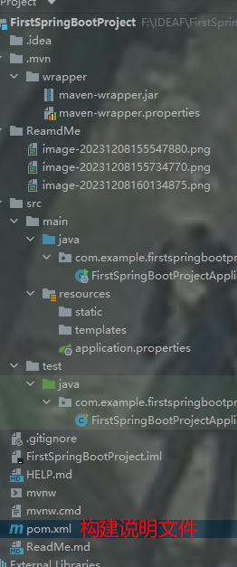
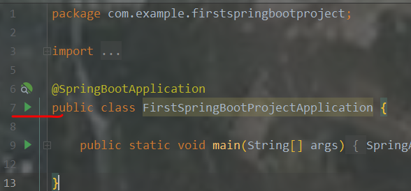
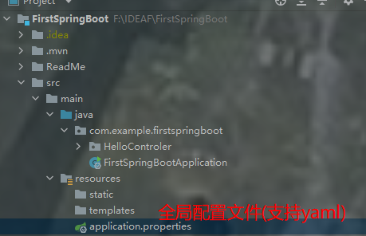
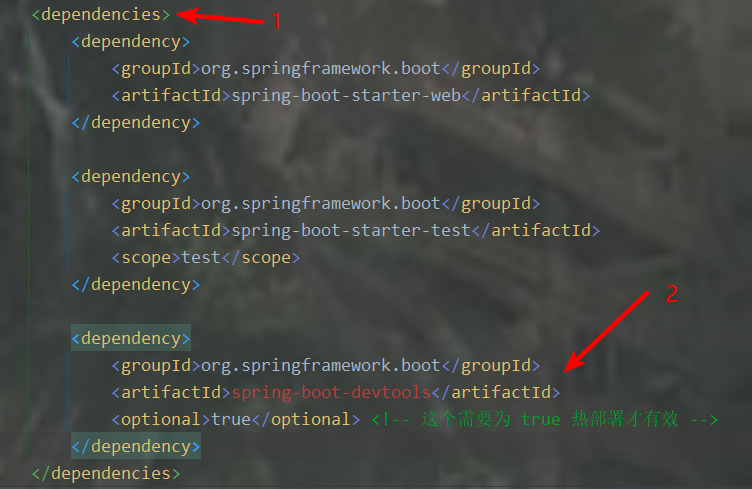

# 快速搭建Spring Boot

File ==> New ==> Project ==> Spring Initializr







# 项目结构

- BootcreateApplication： 一个带有 main() 方法的类，用于启动应用程序



- BootcreateApplicationTests：一个空的 Junit 测试了，它加载了一个使用 Spring Boot 字典配置功能的 Spring 应用程序上下文
- application.properties：一个空的 properties 文件，可以根据需要添加配置属性
- pom.xml： Maven 构建说明文件



# Hello Controler

## 在BootcreateApplication所在包内新建包并创建一个HelloControler类

```java
package com.example.firstspringbootproject.controller;

/**
 * @ClassName HelloControler
 * @Description TODO
 * @Author nxl
 * #@Date 2023/12/8 16:10
 **/


import org.springframework.web.bind.annotation.RequestMapping;
import org.springframework.web.bind.annotation.RestController;

//该注解是 @Controller 和 @ResponseBody 注解的合体版
@RestController
public class HelloControler {
    @RequestMapping("/hello")
    public String get(){
        return "Hello Spring boot!";
    }
}
```

## 回到BootcreateApplication类中启动程序




# 解析Spring Boot 项目

## 解析 pom.xml

```xml
    <parent>
        <groupId>org.springframework.boot</groupId>
        <artifactId>spring-boot-starter-parent</artifactId>
        <version>3.2.0</version>
        <relativePath/> <!-- lookup parent from repository -->
    </parent>
```

有了这个，当前的项目才是 Spring Boot 项目，spring-boot-starter-parent 是一个特殊的 starter ，它用来提供相关的 [Maven](https://so.csdn.net/so/search?q=Maven&spm=1001.2101.3001.7020) 默认依赖，**使用它之后，常用的包依赖就可以省去 version 标签。**

### 应用入口

Spring Boot 项目通常有一个名为 *Application 的入口类，入口类里有一个 main 方法， **这个 main 方法其实就是一个标准的 Java 应用的入口方法。**

**@SpringBootApplication** 是 Spring Boot 的核心注解，它是一个组合注解，该注解组合了：**@Configuration、@EnableAutoConfiguration、@ComponentScan；** 若不是用 @SpringBootApplication 注解也可以使用这三个注解代替。

- 其中，**@EnableAutoConfiguration 让 Spring Boot 根据类路径中的 jar 包依赖为当前项目进行自动配置**，例如，添加了 spring-boot-starter-web 依赖，会自动添加 Tomcat 和 Spring MVC 的依赖，那么 Spring Boot 会对 Tomcat 和 Spring MVC 进行自动配置。
- **Spring Boot 还会自动扫描 @SpringBootApplication 所在类的同级包以及下级包里的 Bean** ，所以入口类建议就配置在 grounpID + arctifactID 组合的包名下（这里为 com.heima 包）

### Spring Boot 的配置文件

Spring Boot 使用一个全局的配置文件 application.properties 或 application.yml，放置在【src/main/resources】目录或者类路径的 /config 下。

Spring Boot 不仅支持常规的 properties 配置文件，还支持 yaml 语言的配置文件。yaml 是以数据为中心的语言，在配置数据的时候具有面向对象的特征。

Spring Boot 的全局配置文件的作用是对一些默认配置的配置值进行修改。




## 热部署:（如果资源消耗差不多不如手动重启）

在没部署之前，项目中的任何修改都要重新启动才能得到效果，很麻烦，**修改pom.xml中的配置实现热部署**

**往pom.xml中添加依赖**

```xml
<dependency>
    <groupId>org.springframework.boot</groupId>
    <artifactId>spring-boot-devtools</artifactId>
    <optional>true</optional> <!-- 这个需要为 true 热部署才有效 -->
</dependency>
```



[配置Spring Boot 热部署](https://blog.csdn.net/hezhimin1124/article/details/103800614)